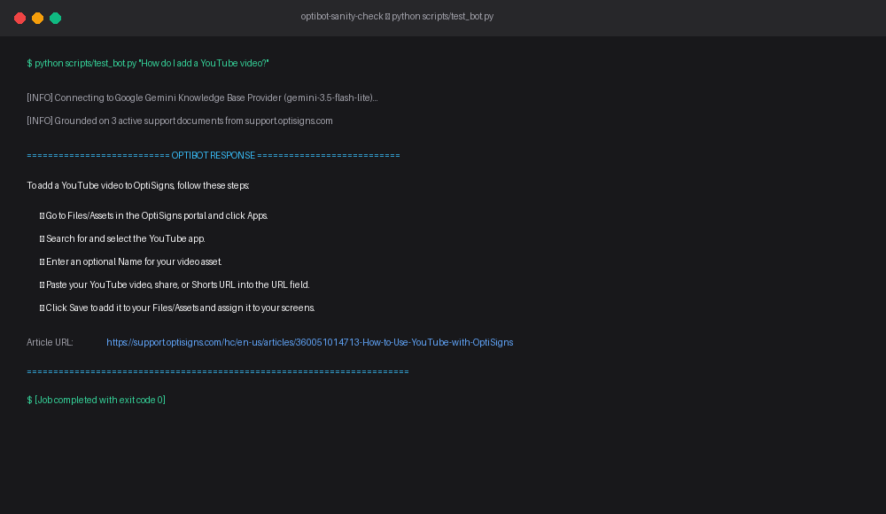

# Knowledge Base Delta Indexer (OptiBot Mini-Clone)

An automated, idempotent RAG ingestion pipeline that scrapes support documentation, normalizes messy HTML into clean Markdown, detects incremental deltas via SHA-256 content hashing, and synchronizes document embeddings with AI knowledge stores.

---

## 1. Quick Setup & Local Execution

### Prerequisites
* Python 3.11+
* Google Gemini API Key (Free tier via [aistudio.google.com](https://aistudio.google.com/)) or OpenAI API Key

### Installation
```bash
# Clone the repository
git clone https://github.com/thaipeace/kb-delta-indexer.git
cd kb-delta-indexer

# Create and activate virtual environment
python -m venv venv
source venv/bin/activate  # On Windows: .\venv\Scripts\activate

# Install dependencies
pip install -r requirements.txt

# Configure environment variables
cp .env.sample .env
# Edit .env and insert your GEMINI_API_KEY
```

### Run Pipeline Locally
```bash
# Execute daily sync batch job (runs once, logs summary, exits 0)
python main.py

# Query the assistant (Sanity Check)
python scripts/test_bot.py "How do I add a YouTube video?"

# Run test suite (20 unit tests)
pytest tests/ -v
```

---

## 2. Docker Execution

The container runs as an ephemeral single-execution batch job and exits with code `0`:

```bash
# Build Docker image
docker build -t kb-delta-indexer .

# Run container with environment variable
docker run --rm -e GEMINI_API_KEY="your_api_key_here" kb-delta-indexer
```

---

## 3. Chunking Strategy & Rationale

* **Methodology:** Header-Aware Markdown Parsing combined with Token Recursive Splitting.
* **Chunk Size:** `800 tokens` (~3,200 characters).
* **Chunk Overlap:** `100 tokens` (~400 characters).
* **Rationale:** Technical troubleshooting guides are step-oriented (Step 1, Step 2, Step 3). Sizing chunks at 800 tokens ensures entire procedural workflows stay cohesive under their respective `##` headers, while a 100-token overlap preserves connective context across split boundaries without fragmenting actionable guidance.

---

## 4. Daily Job Deployment & Public Logs

The sync job runs automatically every day at **02:00 UTC** via GitHub Actions Scheduled Cron.

* **Live Daily Job Logs:** [GitHub Actions Workflow Runs](https://github.com/thaipeace/kb-delta-indexer/actions/workflows/daily_sync.yml)

---

## 5. Sanity Test Verification

**Question:** *"How do I add a YouTube video?"*  
**Prompt Enforced:** Max 5 bullet points, grounded strictly in uploaded documents, citing source URLs.


